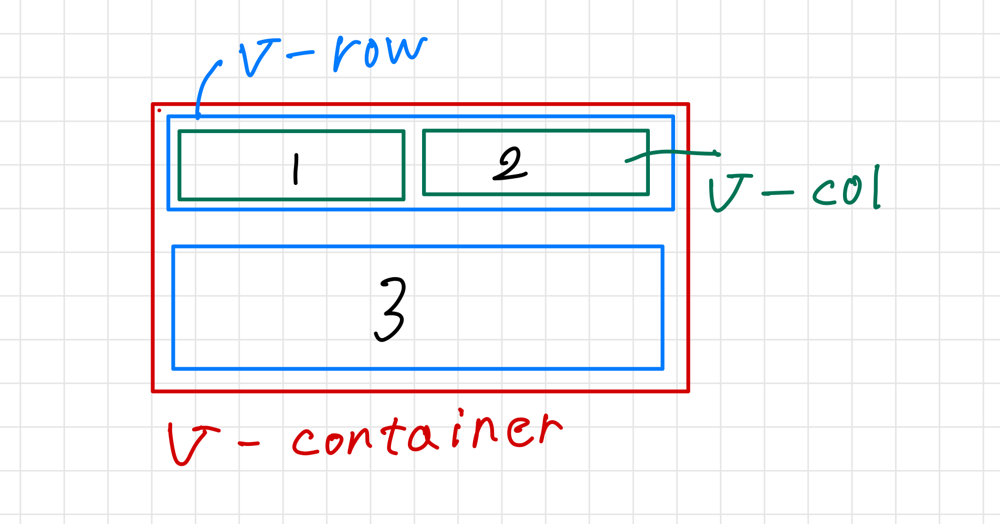

# ページの作り方

## はじめに

### ファイルの構造

```html

<template>
  <v-app>
<!--ここにHTMLを記述-->
  </v-app>
</template>

<style>
/*ここにCSSを記述*/
</style>

<script>
//ここにJavascriptを記述
</script>


```

## 普通と違うところ

- このプロジェクトには[Vuetify](https://vuetifyjs.com/en/)が入っているため特定の機能を作ることが容易になります。  
[Vuetifyのcomponentsの一覧](https://vuetifyjs.com/en/components/all/)  

例えばボタンを作るときは普通は
```html
<button class="favorite styled"type="button">
  Add to favorites
</button>
```
にCSSで装飾していい感じのボタンを作りますが、Vuetifyのコンポーネントを用いることで
```html
<v-btn prepend-icon="$vuetify" variant="tonal">
  Button
</v-btn>
```
これだけでいい感じのボタンを作ることができます。

## 使う言語の概要
### HTML
Webページの内容を記述する言語です。詳細は[初心者向けHTML入門：書き方の基本とタグの使い方(サルワカ)](https://saruwakakun.com/html-css/basic/html)を読んでください。

### CSS
装飾をつけるために使います。

### Javascript
動きをつけるために使います。

## 枠組みについて

HTMLの機能の`div`・`span`、Vuetifyの機能の`v-container`・`v-row`・`v-col`を使います。
[VuetifyのGrid System](https://vuetifyjs.com/en/components/grids/)を参照してください。
[Vuetify Grid System](https://comfortdesignlab.github.io/about/vuetify/grid-system)も参考にしてください。
- v-container  
  サイトのコンテンツの間にパディング（内側の余白）を入れ、コンテンツを中央に配置する機能を提供します。`fluid`を使うこともできます。機能ごとに使ってください。
- v-row  
  `v-col`を包み込むコンポーネントであり`flex`プロパティを使って内部の列のレイアウトを操作できます。複数並べることで要素が**縦**に並びます。
- v-col  
  `v-row`の直接の子要素である（v-rowに包み込まれる）必要があります。複数並べると要素が**横**に並びます。  
- div
  [div](https://developer.mozilla.org/ja/docs/Web/HTML/Element/div)は純粋な枠組みであり何も表しません。`class`や`id`を付与し部分的に装飾を付けたりするのに使われます。
- コード例
```html
<v-container>
  <v-row>
    <v-col><p>1</p></v-col>
    <v-col><p>2</p> </v-col>
  </v-row>
  <v-row><p>3</p> </v-row>
</v-container>
  
```  

  
- その他参考リンク  
[Vuetifyでcolの隙間を調整する](https://zenn.dev/code_diver/articles/1073c6dcbd776f)  
[Gutterの説明](https://getbootstrap.jp/docs/5.0/layout/gutters/)  
[CSSグリッドレイアウトについて](https://zenn.dev/arisa_dev/books/markup-lesson6)  
[マークアップ言語シリーズ(zenn books)](https://zenn.dev/arisa_dev?tab=books)


## テキストについて
- HTML機能の`<hx>``<p>`（xは1以上６以下の整数）
- vuetifyの機能で`<v-container>`を使い`class`でプロパティを指定する（[VuetifyのText and typographyを参照](https://vuetifyjs.com/en/styles/text-and-typography/)）
- コード例
  ```html
  <h1>これはh1タグです。タイトルなどはこれを使います。</h1>
  <h6>これはh6タグです。</h6>
  <p>これはpタグです。段落を作るときに使います。</p>

  <div class="text-body-1">これはclass="text-body-1"が付与されています。</div>
  <v-container class="text-subtitle-1">これはclass="text-subtitle-1"が付与されています。</v-container>
  ```

## 画像を挿入する
- [img](https://developer.mozilla.org/ja/docs/Web/HTML/Element/img)を使う  
  ソースはサーバー内外の画像ともに使えます。また、終了タグがありません。
- [v-img](https://vuetifyjs.com/en/components/images/)を使う  
  サーバー外の画像では正常に機能しますが、サーバー内の画像では正常に機能しません。サーバー内の画像の場合は`v-img`を使ってください。

- コード例
  ```html
  
  <v-img src="https://placehold.jp/150x150.png" alt="v-imgタグを使ってます。"></v-img>
  ```
  
## 条件分岐(条件付きレンダリング)
- [v-if,v-if-else,v-else](https://ja.vuejs.org/guide/essentials/conditional.html)
  適宜div等で囲って使用してください。