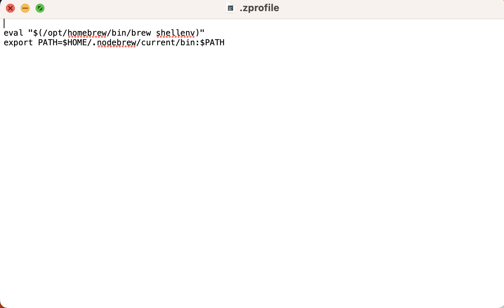

# yarnのインストール（Mac版）
流れは以下の通りです。
1. Homebrewのインストール
2. nodebrewのインストール
3. yarnのインストール

## ターミナルの開き方
デスクトップの`Lanchpad`（左下のアプリ一覧）を開く

`その他`を開く

`ターミナル`を開く

## Homebrewのインストール
[Homebrew](https://brew.sh/index_ja)はmacOS（またはLinux）でモジュール（プログラムの部品）を管理するためのパッケージマネージャーです。  
公式サイトのインストール部分にあるコマンドをコピーしてターミナルに貼り付けて実行してください。管理者権限を持たないユーザーの場合はこのコマンドを実行できません。そのユーザーに管理者権限を与えてください。  

`Checking for sudo access ~~~`と`Password:🔑`が表示されたらパスワードを入力してください。

`Press RETURN/ENTER ~~~`が表示されたらリターンキーを押してください。

次にHomebrewのpathを通します。  
pathを通すとは[このページを見てください](https://qiita.com/sta/items/63e1048025d1830d12fd)  
簡単に言うと、あるプログラムをプログラムの名前だけで実行できるようにすることです。

画像の部分をコピーしてターミナルにペーストして実行してください。  
パスを通した設定を適用させるためにターミナルを終了させてください。（パスを通したことを記述したファイルがターミナル起動時に読み込まれるため）
`brew -v`を実行しバージョン番号が出たら成功です。
  

`/usr/local/bin`が表示されたら成功です。？  
別の場所（/user/ユーザネームの下の任意のディレクトリ）で`brew -v`を実行しバージョン番号が出たら成功です。？  

## nodebrewのインストール
[nodebrew](https://github.com/hokaccha/nodebrew)はNode.jsのバージョン管理ツールです。  
ターミナルで`brew install nodebrew`を実行してください。  

次に`nodebrew setup`を実行。色々出ます

パスを通すために`echo 'export PATH=$HOME/.nodebrew/current/bin:$PATH' >> ~/.zshrc`を実行してください。(上画像下から3行目)  
パスを通す設定を適用するために`source ~/.zshrc`を実行してください。

## node.jsのインストール
[Node.js]()はJavaScriptをサーバーサイドで実行するためのプラットフォームです。
ターミナルで`nodebrew install-binary stable`を実行してください、node.jsがインストールされます。

`nodebrew ls`実行でインストールしたnode.jsのバージョンを確認し、`nodebrew use 確認したバージョン`実行でnode.jsを有効化してください。  
例：`nodebrew use v12.16.1`

ここでインストールの確認をします。
`node -v`と`npm -v` をそれぞれ実行してバージョン番号が表示されたら成功です。

## yarnのインストール
[yarn](https://yarnpkg.com/)（読み：やーん）は主にJavascriptで開発されたモジュール（プログラムの部品）を管理するためのパッケージマネージャーの一つです。同様の機能を持つ[npm]()と互換性があります。
ターミナルで`npm install -g yarn`を実行してください。

その後、`yarn -v`を実行してバージョン番号が表示されたら成功です。

## 追記
pathを通す設定が書かれているファイルは\user\ユーザーネームの中で隠しファイル(.zprofile)になっています。`command + shift + .`で隠しファイルの表示の切り替えができます。

echo 以下の''の中身をコピーしてこのファイルに直接書き込むことでも設定できます。
